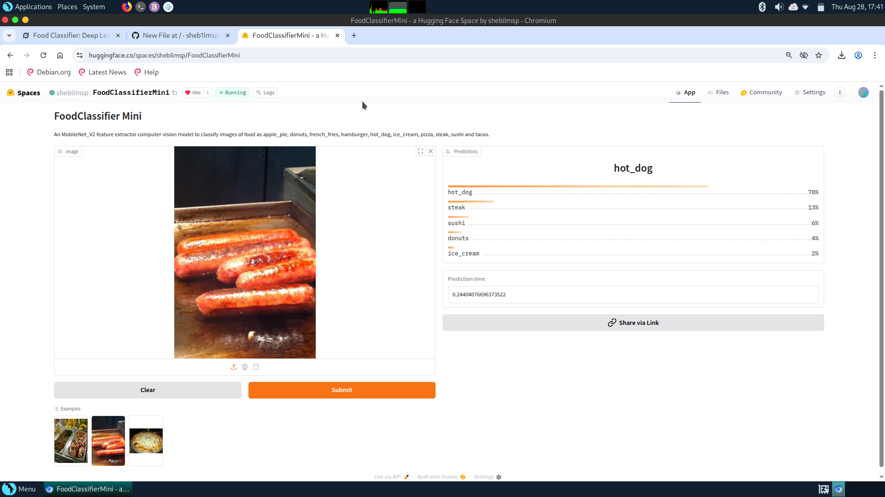

# Food Classifier



## Overview

The Food Classifier is a machine learning project that uses a pre-trained **MobileNetV2** model to classify food images into 10 categories: **apple pie**, **donuts**, **french fries**, **hamburger**, **hot dog**, **ice cream**, **pizza**, **steak**, **sushi**, and **tacos**. Implemented in a single Jupyter notebook, the project provides an end-to-end workflow for food recognition. It is deployed on **Hugging Face Spaces** for easy access and inference, making it suitable for applications like dietary tracking or culinary recommendation systems.

## Features

- **MobileNetV2-based Classification**: Fine-tuned MobileNetV2 model for classifying 10 food categories.
- **10-Class Food Recognition**: Classifies images into apple pie, donuts, french fries, hamburger, hot dog, ice cream, pizza, steak, sushi, or tacos.
- **End-to-End Notebook**: Includes data preprocessing, model training, evaluation, and inference in `Food_Classifier.ipynb`.
- **Hugging Face Deployment**: Deployed on Hugging Face Spaces for online inference.
- **Lightweight and Efficient**: MobileNetV2 ensures fast inference, suitable for web or mobile applications.

## Installation (For Local Setup)

To run the Food Classifier locally, follow these steps:

1. **Clone the Repository**:

   ```bash
   git clone https://github.com/sheb1lmsp/Food-Classifier.git
   cd Food-Classifier
   ```

2. **Install Dependencies**: Ensure Python 3.8+ is installed. Install required packages:

   ```bash
   pip install -r requirements.txt
   ```

3. **Open the Notebook**: Launch the Jupyter notebook:

   ```bash
   jupyter notebook Food_Classifier.ipynb
   ```

## Usage

### Running Locally

The `Food_Classifier.ipynb` notebook contains the complete workflow:

1. **Data Preprocessing**: Loads and preprocesses food images for the 10 classes.
2. **Model Training**: Fine-tunes the pre-trained MobileNetV2 model.
3. **Evaluation**: Assesses model performance.
4. **Inference**: Classifies new images into one of the 10 food categories.

To run locally:

1. Open `Food_Classifier.ipynb` in Jupyter Notebook or JupyterLab.
2. Execute cells sequentially, following the notebook’s instructions.
3. For inference, update the inference cell with the path to a food image.

### Using on Hugging Face Spaces

The Food Classifier is deployed on Hugging Face Spaces. To use it:

1. Visit the Hugging Face Space https://huggingface.co/spaces/shebilmsp/FoodClassifierMini.
2. Upload a food image or provide an image URL.
3. The app will classify the image into one of the 10 categories (apple pie, donuts, french fries, hamburger, hot dog, ice cream, pizza, steak, sushi, tacos) and display the predicted class with confidence.

## Example

### Local Inference

Update the inference cell in the notebook, e.g.:

```python
image_path = "./sample_images/pizza.jpg"
# Run the inference cell
```

Example output:

```
Predicted class: Pizza
Confidence: 0.93
```

### Hugging Face Spaces

1. Upload an image of a food item (e.g., a taco) to the web interface.
2. Click "Submit." Example output in the web UI:

```
Predicted class: Tacos
Confidence: 0.95
```

## Project Structure

```
Food-Classifier/
├── models/               # Directory for trained MobileNetV2 models
├── examles/              # Directory for examples images
├── notebooks/
  └── Food_Classifier.ipynb   # Jupyter notebook with complete workflow
├── app.py                # Script for Hugging Face Spaces deployment
├── create_model.py       # Script for creating MobileNet_V2 feature extractor
├── class_names.txt       # List of selected class names
├── requirements.txt      # List of required Python packages
├── LICENSE               # MIT License file
└── README.md             # Project documentation
```

## Configuring the Application

### Local Configuration

All configuration is managed within `Food_Classifier.ipynb`. To customize:

1. **Dataset Path**: Update the dataset path in the notebook’s data loading section.
2. **Hyperparameters**: Adjust learning rate, batch size, or epochs in the training section.
3. **Model Setup**: Pre-configured for 10 classes (apple_pie, donuts, french_fries, hamburger, hot_dog, ice_cream, pizza, steak, sushi, tacos).
4. **Device**: Automatically uses GPU if available.

### Hugging Face Spaces

The `app.py` script is pre-configured for inference with the trained model. To modify the deployment:

1. Update `app.py` for changes to the web interface or model loading.
2. Push changes to the repository to redeploy on Hugging Face Spaces.

System: Spaces.

## Contributing

Contributions are welcome! To contribute:

1. Fork the repository.
2. Create a new branch (`git checkout -b feature-branch`).
3. Modify the notebook, `app.py`, or other files and commit (`git commit -m "Add feature"`).
4. Push to the branch (`git push origin feature-branch`).
5. Open a Pull Request.

Ensure changes are documented and maintain compatibility with the 10-class setup and Hugging Face deployment.

## License

This project is licensed under the MIT License. See the LICENSE file for details.


© 2025 Mohammed Shebil
